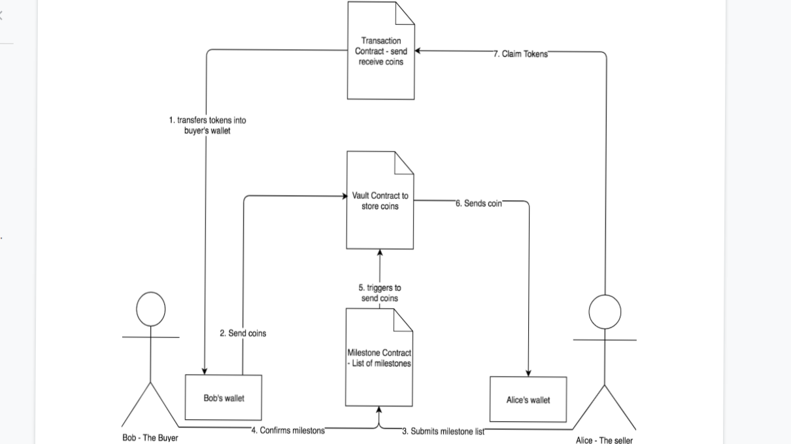

# escrow-service-generator
It provides implementation of ERC20 token,Milestone contract,Vault contract and Receive contract, you can use these contracts as a reference to implement an escrow service according to your logic


### Workflow

<div align="center">
       
</div>


### Installation
```
npm install escrow-service-generator
```

### Usage

```
pragma solidity ^0.5.5;

import 'escrow-service-generator/ERC20/ERC20Token.sol';
import 'escrow-service-generator/Service/Milestone.sol';


```


> You need an ethereum development framework for the above import statements to work! Check out these guides for [Truffle](https://truffleframework.com/docs/truffle/quickstart) or [Embark](https://embark.status.im/docs/quick_start.html).


## Authors

* **Rahul Buddhdev** -(https://github.com/rahulthakkar796)


## License

This project is licensed under the MIT License - see the [LICENSE.md](LICENSE) file for details

